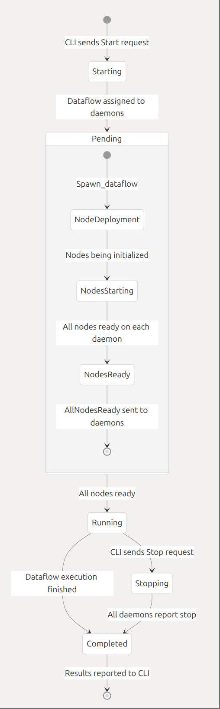

首先要明白一件事：dora的工作流程

这个项目的工作核心就是数据流的构建，在yaml文件中定义；除此之外，yaml还定义nodes，包括他们的输入和输出，以及节点之间的连接，其实和arceos一定程度上是类似的。

启动后，dora-cli会发送一个start数据流给dora-coordinator,然后coordinator会根据yaml文件中的配置来构建数据流，再发送给dora-daemon，再由daemon启动node进行执行

看郑哥的手册，发现有一点我误会了，dora的预编译文件不是整个dora项目，他指的就是doracli这个入口，ok那先从源码构建这个可执行文件

简单来说，这个工程项目想第一步在arceos上跑起来，首先就是得编译成可执行文件，之后明白这个可执行文件的依赖库，这一步往往依赖ldd输出,之后就是打包成镜像，集成到arceos的构建镜像脚本中

目前第一步，构建出arceos的文件系统，效仿linux的文件系统把dora挂上去